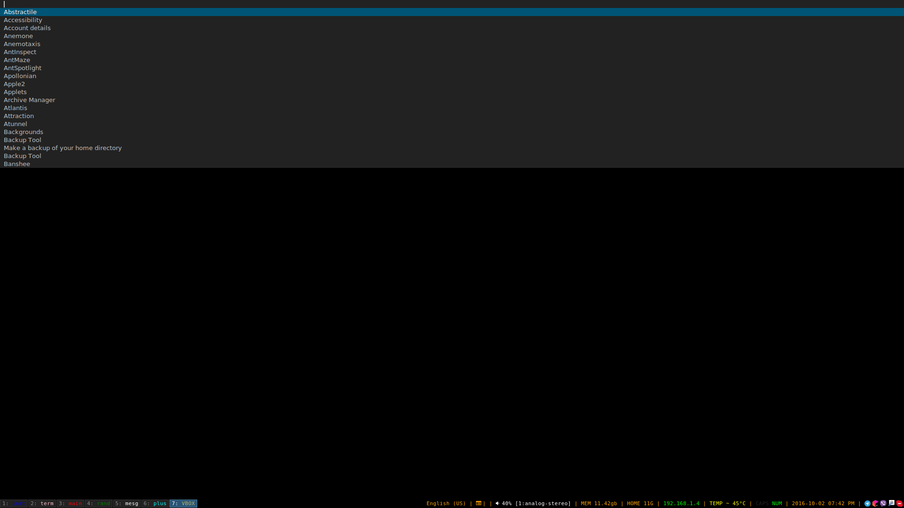

i3 window manager configuration 

```
!!!UNSTABLE!!!
```

based on: 
- https://github.com/vivien/i3blocks - author of `i3blocks` status bar for `i3`
- https://github.com/Anachron/i3blocks - recipes for installation and customization of `i3blocks`
- https://github.com/enkore/j4-dmenu-desktop - wrapper for `dmenu` staff, that allow user drop-down list of apps

include the script based on the post of user ***ack006*** - [script post](https://faq.i3wm.org/question/2172/how-do-i-find-the-criteria-for-use-with-i3-config-commands-like-for_window-eg-to-force-splashscreens-and-dialogs-to-show-in-floating-mode.1.html) for definition of the window class

```
assign [class="google-chrome"] ...
```

#install of i3 to my linux mint was provided with 
```
sudo apt-get install i3 \
                     i3lock \ 
                     i3blocks \ 
                     suckless-tools \ 
                     i3status \ 
                     dunst \ 
                     libanyevent-i3-perl \ 
                     libjson-xs-perl \ 
                     j4-dmenu-desktop \ 
                     kbdd \ 
                     rofi 
```

#disable nemo desktop issue
```
gsettings set org.nemo.desktop show-desktop-icons false
```

#j4-dmenu-desktop
```
usage bindsym $mod+d exec --no-startup-id j4-dmenu-desktop --dmenu="dmenu -i -fn 'DejaVu Sans-10' -l 20"
```


#Current state with j4 drop-down 
